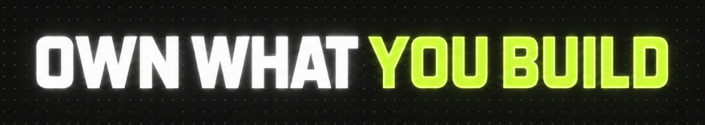

<picture>
  
</picture>

<h2 align="left">ABOUT</h2>

무엇을 왜 만드는지 이해하고, 선택 하나하나에 분명한 이유를 담고자 합니다.
구현에서 끝내지 않고, 실제로 쓰이는 경험을 살피며 더 나은 결과로 다듬어가는 과정을 중요하게 생각합니다.

<h2 align="left">PROJECTS</h2>

**WYBU**

AI와의 작업이 다음 세션에도 이어질 수 있도록, 작업 기록·결정·진행 상황의 맥락을 연결하는 도구를 만들고 있습니다.
세션이 바뀔 때마다 다시 설명해야 하는 일을 줄이고, 긴 작업의 흐름을 이어가는 방법을 고민합니다.

<h2 align="left">TOOLBOX</h2>

Java, SQL, MyBatis를 배우며 API의 Controller·Service·DB가 연결되는 흐름을 익혔습니다.

<h2 align="left">LINKS</h2>

[포트폴리오 ↗](https://hdev-x.vercel.app/) · 프로젝트와 개발에 대한 생각을 정리했습니다.
