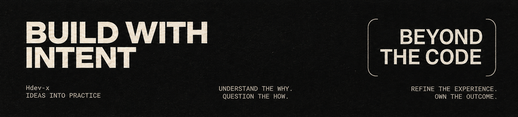

<picture>
  
</picture>

 

<picture>
  
</picture>

 

사용하면서 느끼는 불편에서 출발해, 무엇이 문제이고 어떻게 바꾸면 더 편해질지 고민합니다. 문제를 작은 단위로 나누고 맥락과 기준을 정리해, 다양한 해결 방법을 빠르게 시도합니다. 선택의 이유와 결과를 직접 확인하며, 실제로 쓰이는 경험까지 다듬어가는 일을 중요하게 생각합니다.

아이디어를 구현하는 일이 쉬워지는 만큼, 만들어진 것을 이해하고 원하는 방향으로 고쳐 나가는 경험에 관심을 두고 있습니다. 경험의 차이로 막히는 순간을 줄이고, 더 많은 사람이 자신의 생각을 구현하고 발전시킬 수 있도록 돕는 도구와 작업 방식을 구체화하고 있습니다.

 

<h3 align="left">PROJECTS</h3>

<dl>
<dd>

  <strong><a href="https://hdev-x.vercel.app/#work">WYBU</a></strong> — AI와의 작업 기록·결정·진행 상황을 다음 세션에서도 이어갈 수 있도록 돕는 도구

  <strong><a href="https://github.com/Hdev-x/kopang">Kopang</a></strong> — 고객 이탈 위험을 감지하고 맞춤 대응의 효과까지 측정하는 커머스 프로젝트

  <strong><a href="https://github.com/Hdev-x/petcare">PetCare AI</a></strong> — 반려동물 건강 기록·사진 기반 AI 관찰·경과 관리·응급 병원 탐색을 연결하는 서비스

  <strong><a href="https://github.com/Hdev-x/Bubit">Bubit</a></strong> — 여러 거래소의 실시간 시세와 차트를 한곳에서 확인하는 PC·모바일 암호화폐 분석 앱

</dd>
</dl>

 

<h3 align="left">TOOLBOX</h3>

<dl>
<dd>

**Languages**

**Development**

**Workflow**

</dd>
</dl>
